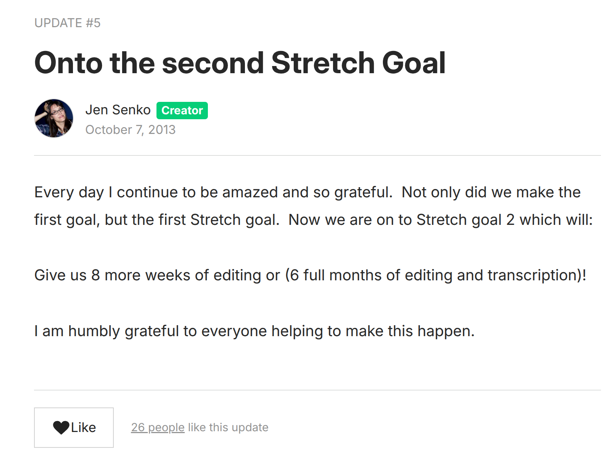

# Monotheism / MonoMyth

Of course this is a mess of a document. Very raw, unedited, uncorrected.

"Now, today (1987) there is no out-group anymore on the planet. And **the problem of a modern religion is to have such compassion work for the whole of humanity**. But then what happens to the aggression? This is **a problem that the world is going to have to face** — because aggression is a natural instinct just as much as, and more immediate than, compassion, and it is always going to be there. It’s a biological fact." - Joseph Campbell, age 83, year 1987

Technology of being able to organize a virus or bacteria to spared disease deliberately, knowledge to do so, biological terrorism or warfare. Some radical new physics development (discovery) that would allow targeted killing from remote distance.

## Common Ground 

The enjoyment of sports and competition, winners, heroes.

Racial superiority, skin color superiority, education superiority, technology superiority, common understanding superiority, team behavior superiority, working together superiority, gender superiority (sports divide genders frequently).

Asset superiority, land ownership superiority, strategic real estate location superiority.

Trademark, trade secret, certification of skill, superior validation and testing that a device or ingredient is pure / without flaws (such as aircraft repair and maintenance parts validation, supply chain to avoid tampering / fraud).

&nbsp;

## Flaunting, conspicuous consumption, status symbols

Showing off, museum rarity, collectible, antique, rarity, special, prized.

&nbsp;

## Parenting in Palestine year 2024

Living in Gaza and parenting in year 2024. Living in Ukraine and parenting in year 2024. Living in [Japan and parenting in year 1945](https://en.wikipedia.org/wiki/Grave_of_the_Fireflies).

&nbsp;

# Monotheism

One god or many gods, one agreement.

I sometimes view Islam as a revision of Christianity from the perspective that prayer was taken to structure and routine. Like adding automatic routine oil changes for a internal combustion gasoline mechanical car engine. Or routine maintenance on an aircraft engine.

["Salat times are prayer times when Muslims perform salat. The term is primarily used for the five daily prayers including the Friday prayer, which takes the place of the Dhuhr prayer and must be performed in a group."](https://en.wikipedia.org/wiki/Salah_times)

Look at areas in human life where routine and timing come up: summer time off work, summer time off schools, weekend weddings and parties and camping trips and nightclubs and movie premiers, but then you can also see offset: were home movie releases and video game releases in North America often on Tuesday intentionally not to compete with weekends?

Live music band concerts by many famous bands in 1960 to 2019 were not fixed in one location, and often subject to travel complications (cancellations of shows), sickness (travel may expose one to more illness from food or person to person, or injury), venue restrictions (not allowing fireworks, too large or too small to accommodate a theater-like performance such as Styx Mr. Roboto opera)

Did adding routine prayer work? Did it prevent things.

[Debate on 3 prayers a day or 5, etc](https://www.medinaminds.com/sunni-prayer-vs-shia-prayer/)

My blunt stance is that personal biology comes into play. At age 16 hormones of a boy may drive needs for medication (prayer) self-reflection that the same person at age 28 may find different. Probably better example than tht.

Alas, some of it is driven by structure. If someone's job (profession, "making a living") is being an air pilot for trips across the oceans that take 9 hours and such, and they work long days for 4 days a week and have 3 days off, their prayer needs may be very different base on being in a busy city or more relxed setting on their days off work. Are they a preent raising children? Are they building a house that takes 1 or 2 years?

If everyone is at a sports stadium or a live music concert or a cinema / movie theater or live theatrical play - there are routines on start time, end time (exiting, transportation home), and even toilet usage schedules.

Did organized prayer (meditation) make for better people? Did it refresh the programming of that one specific religion - making it harder for people to peer with people from other religions? Is it like repeating your native langauge lesosns to make sure you aren't making common grammar and syntax mistakes on a daily basis for 30 minutes, or like a police officer who has to clean their weapon and go to the firing range to practice their aim? (of course, maybe better examples) - do cooks who work professionally 5 days a week full time have to take refresher courses on food safety and nutrition if they are also the menu planner?

I do see a major problem with book supremacy. Torah, Bible, Quran - and claiming that out of the entire world public library of all books (stories, oral or writen) that ONLY one story is perfect and all other science fiction stories are imperfect / wrong.

In my 55 years alive and world travels, I agree with Joseph Campbell at age 83: 

1. "That’s the reduction of mythology to theology. Mythology is very fluid. Most of the myths are self-contradictory. You may even find four or five myths in a given culture, all giving different versions of the same mystery. Then theology comes along and says it has got to be just this way. Mythology is poetry, and the poetic language is very flexible. Religion turns poetry into prose. God is literally up there, and this is literally what he thinks, and this is the way you’ve got to behave to get into proper relationship with that god up there."
2. "you have to break past your image of God to get through to the connoted illumination. The psychologist Jung has a relevant saying: “Religion is a defense against the experience of God.” The mystery has been reduced to a set of concepts and ideas, and emphasizing these concepts and ideas can short-circuit the transcendent, connoted experience. An intense experience of mystery is what one has to regard as the ultimate religious experience."
3. "Now, eternity is beyond all categories of thought. This is an important point in all of the great Oriental religions. We want to think about God. God is a thought. God is a name. God is an idea. But its reference is to something that transcends all thinking. The ultimate mystery of being is beyond all categories of thought. As Kant said, the thing in itself is no thing. It transcends thingness, it goes past anything that could be thought. The best things can’t be told because they transcend thought. The second best are misunderstood, because those are the thoughts that are supposed to refer to that which can’t be thought about. The third best are what we talk about. And myth is that field of reference to what is absolutely transcendent."

&nbsp;

blah blah blah. I may never revisit this page or fix the mistakes.I don't know. What I wrote on this page is incomplete, not what I agree with, more an attempt to shuffle around ideas that come from other people (I was thinking about [Asimov's Foundation book stories about the robots influencing](https://www.youtube.com/watch?v=1mKCKt3xRnw) human history for tens of thousands of years, laying a pattern out for [psychohistory](https://en.wikipedia.org/wiki/Foundation_universe#Psychohistory) shortly before I opened and created this page you are reading). 

&nbsp;

# Malala / Forest for the Trees

I have a strong desire that humanity cherry-pick from all religions, all the public library, good ideas. Living under Donald Trump in July 2025 ... people are seeking bad, attracted to badness itself, and self-harm on a national scale in the USA. Just as I see in September 2023 the Palestine / Gaza society was self-harming on a national scale (and I am so sad to see social media users not quote / assert / repeat with regularity Malala Yousafzai since October 8, 2013 publication of her book... the lack of attraction to great thinking and ideas about mass man / society / global behavior and reformation). 

Asimov's Psychohistory is about avoiding major wars / chaos / self-harm. In my view, it isn't about Malala being the best, number one winner, it is that she clearly has her finger on exactly what Joseph Campbell said in year 1987 earlier in this document: "the problem of a modern religion is to have such compassion work for the whole of humanity. But then what happens to the aggression? This is a problem that the world is going to have to face" - and Malala was born 10 years after that summer 1987 statement... her birth-date July 12, 1997.  She intuitively experienced this in Swat Valley Pakistan.

["everything changed when the Taliban took control of their town in Swat Valley. The extremists banned many things — like owning a television and playing music — and enforced harsh punishments for those who defied their orders. And they said girls could no longer go to school. In **January 2009, when she was just 11 years old**, she said goodbye to her classmates, not knowing when — if ever — she would see them again."](https://malala.org/malalas-story)

Clearly she was on the world information systems / public libraries / internet when her book was released October 8, 2013. And in all the years since (July 28, 2025 as I type this page), I have seen very little in the Islamic society or USA / UK / media / social media that says: we really should have given more lip service / more repeating of Malala. It is also in my mind that [one month after](https://en.wikipedia.org/wiki/Miss_Universe_2013) October 8, 2013 publication of Malala's book... is when Donald Trump was setting role models for girls in Moscow. And then one moth after that, in December 2013, the ["Conservative International 2013" global movement](https://www.theatlantic.com/international/archive/2013/12/vladimir-putin-conservative-icon/282572/) was formally announced - basically *Taliban values* initiative that has fueled the rise of Donald Trump here in the USA.

Further... media ecology wise, you have Malala's book at the public library October 8, 2013 ... and you have the Russian Internet Research Agency online and active in middle 2013. ["The Internet Research Agency itself, founded last summer (summer of 2013), now employs over 600 people"](https://www.buzzfeednews.com/article/maxseddon/documents-show-how-russias-troll-army-hit-america) - June 2, 2014.

And guess which shit gets repeated... hate motivates, hate thrives, Fox News is the most popular HDTV news network in USA... anonymous no-identity social media where only rich and famous people use their real names (or people selling things with LinkedIn or book author or other "my brand" selling personas)... but Reddit, Twitter... which are influential to various groups - is almost all people who hide real names and real life since year 2013 and let certain selling-oriented or famous and rich people use their real names. That's a vast topic. More concerning is Fox News popularity, **year 2015**: ["Fox News, with a dominant primetime lineup and host to the most-watched presidential primary debate on record, remained the No. 1 ratings player in cable news and finished second overall to ESPN in primetime total viewership — the highest-ever finish for any cable news network."](https://variety.com/2015/tv/news/cable-news-ratings-cnn-top-gainer-fox-news-channel-dominant-1201666151/)

All of year 2015, the full year, Malala's book surely was on the public library shelf and quotes handy in all her book tours in late 2013. Published October 8, 2013 ... that gives more than 14 full months before start of January 2015... so the book was out there.  But what do Americans see that the word needs? Rupert Murdoch messages, flocking to Rupert Murdoch's ideas and views.

blah blah blah blah blah blah blah, can't someone else write this who is't so sick of living in this stew of Donald Trump hate-worship and [Donald Trump hate clubs since November 2012](https://www.theguardian.com/world/2012/nov/07/donald-trump-twitter-tirade-obama)? The hate and mass dehumanization just keeps getting worse every single month since November 2012 when Trump became rise to the center of attention was in motion. Every fucking day, every month, worse than the last. July 2025 USA is nightmare levels worse than ever.

&nbsp;

# Jen Senko / Fox News 2015

https://en.wikipedia.org/wiki/The_Brainwashing_of_My_Dad

"The film gained 947 backers on Kickstarter. People who noticed the campaign and had similar stories wrote to Senko."

Jen Senko's Kickstater posting UPDATE 5 shows "October 7, 2013" (Putin's Birthday, also October 7 is the day Fox News went online in 1996)... https://www.kickstarter.com/projects/jensenko/the-brainwashing-of-my-dad-documentary/posts/622014

From what I see, "Sep 30 2013 - Oct 30 2013 (30 days)" was the kickstarter campaign dates.

Jen Senko is starting this film funding September 2013 - right when Donald Trump is promoting Moscow Miss Universe 2013 and traveling to Russia on November 8, 2013. https://www.CNBC.com/2018/04/23/flight-records-contradict-trump-on-2013-moscow-trip-report.html

When did your *well informed* Internet users learn about this film project. Ideally they would have found out in the Kickstarter phase back in 2013... it raised $40,325 - which is not much. If just a single person, Jen Senko, worked on the film for one year... that isn't much of a salary after covering any expenses. Seems pretty clear with that low of a budget, that is strictly the labor and cost of making the film. Distributing it and promoting it is a more expense.

July 29, 2015 (Traverse City Film Festival) ok - so it becomes known in the summer of 2015 - Fox News is the most popular. Did the *well informed* social media users catch on the [6 weeks prior June 16, 2015 start of offical Donald Trump climb to President](https://en.wikipedia.org/wiki/Donald_Trump_2016_presidential_campaign)?

That's the problem I see with society, people *bitching* about Fox News influence on their family, but not reaching for articles / citations / references. For example, I have kept a close eye on one article on The Atlantic since September 16, 2020 ["Do You Speak Fox? How Donald Trump’s favorite news source became a language" By Megan Garber](https://www.theatlantic.com/culture/archive/2020/09/fox-news-trump-language-stelter-hoax/616309/) - as the whole Tower of Babel, media ecology front and center. Alternate reality via language and meaning - that's hard-core Marshall McLuhan (University of Toronto) topic of media ecology. Finnegans Wake... as [in **year 1924 onward publication Woke... Wake** to media, media woke](https://en.wikipedia.org/wiki/War_and_Peace_in_the_Global_Village).

March 18, 2016 (Theatrical and streaming) - so this is before the November election. Now the film is out for anyone... but social media, *crickets*. A few mentions here and there, but not the sustained call to intellectual arms - let's all get beyond Jen Senko!

I also this month (July 2025) have latched into my brain that Jen Senko is a **baby boomer**, and here she is, by her own self, kickstarter of a film about her own internal family - confronting what Reddit and Bluesky (of course, Bluesky only really big since November 2024, but that same set of Internet community wherever they were before) bitch about constantly, *right-wing media*.

And you have The Little Guy, Jen Senko, speaking Truth to Power... and social media doesn't give her the lip service, retweeting, repeating repeating repeat that Jen Senko needs. She should have been made a household name. No matter if you don't like the film, like Al Gore's Inconvenient Truth, it's a LONG TERM ISSUE like Al Gore's Inconvenient Truth.  Let Jen Senko inspire people to make more films, books, and stay focused on the very idea of distorted reality from right-wing media. (And Malala did just that in her October 8, 2013 book, right-wing radio "Radio Mullah" - that was covered all over the press in 2013 world wide). Malala is confronting right-wing media (radio) influence on her family in intimate detail in 2013, and so too was Jen Senko... you see?

But social media internet society is not getting behind "The Litlte Guy", that's the problem with spirtual and religion.  People are far more enthusiastic about sports stars than people making books and films about the entire world *progress / progressive* improvements.  Millions of messages a day of people bitching about Fox News and Newsmax, why can't Jen Senko be the **baby boomer who stood up to the other baby boomers and spoke critical thinking**? And her inspire people to make their own films, books, podcasts if her work isn't satisfying everyone?

yes, this writing is poor. If I could do better, I would... Brain damage from all these topics and information warfare. And I am FAR from the only person with (mass mind) brain damaged by Trumpism / MAGA / Cambridge Analtyica media. Reminder: ["Do You Speak Fox? How Donald Trump’s favorite news source became a language" By Megan Garber](https://www.theatlantic.com/culture/archive/2020/09/fox-news-trump-language-stelter-hoax/616309/)

&nbsp;

.

# right-wing news as a quasi-religious phenomenon

Mythological fiction. All religions are science fiction.

"A new sociological study offers a surprising take on the state of American news: right-wing news media doesn’t just sit on the opposite end of the political spectrum from mainstream outlets—it operates more like a religion than a traditional news source."

https://old.reddit.com/r/science/comments/1mbo1ar/a_new_sociological_study_offers_a_surprising_take/

https://www.researchgate.net/publication/390308555_Beyond_Polarization_Right-Wing_News_as_a_Quasi-religious_Phenomenon

https://journals.sagepub.com/doi/10.1177/07352751251326951

First published online March 29, 2025

"Research on U.S. political media has demonstrated that mainstream and right-wing news are qualitatively distinct in a variety of ways. However, the dominant paradigm of political polarization and its attendant assumptions have restricted researchers from putting these descriptive insights into new and potentially generative theoretical context. In this article, we propose a way forward, arguing for the merits of conceptualizing right-wing news as a quasi-religious phenomenon. Putting empirical findings in dialogue with core theoretical insights from the sociology of religion, we argue that the right-wing news ecosystem has epistemic, functional, and ecological features that are more characteristic of religion than its mainstream media counterpart. We illustrate the usefulness of these distinctions by applying them to the case of Fox News and their reporting of the 2020 presidential election. Finally, we discuss how our conceptual framework advances current and future research on mis/disinformation, international politics, and the structural causes and consequences of right-wing news media’s ascendance."

"Although not a formal religious institution, we argue that the dominant approach to truth
in the right-wing news ecosystem operates in much the same way. This is not to say that
right-wing news organizations and audiences do not care about empirical knowledge or
facts; but it is to say that the most important epistemic litmus test for truth claims in this
media system is not whether such claims accurately represent empirically observable events
in the world but, rather, to what extent they confirm or challenge the sacred tenets of the
belief system. Empirical truths, to the extent they are recognized and reported on as such
within right-wing media, are ultimately subordinate to more axiomatic, “self-evident,”
sacred ones. This claim was recently supported by Pretus et al. (2023) in a study where they
find misinformation sharing among right-wing participants is strongly associated with items
reflecting sacred values."

