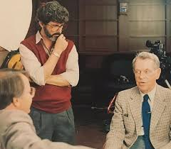

# Joseph Campbell on Metaphors

&nbsp;

George Lucas filmed at Skywalker Ranch, California in summer of 1986 and summer of 1987 for the Star Wars / Hollywood audience to understand the big picture. Published in 1988.

In summer of 1987, Joseph Campbell was age 83, he died later that year.

&nbsp;

BILL MOYERS: Eden was not. Eden will be.

JOSEPH CAMPBELL: Eden is. “The kingdom of the Father is spread upon the earth, and men do not see it.”

MOYERS: Eden is—in this world of pain and suffering and death and violence?

CAMPBELL: That is the way it feels, but this is it, this is Eden. When you see the kingdom spread upon the earth, the old way of living in the world is annihilated. That is the end of the world. The end of the world is not an event to come, it is an event of psychological transformation, of visionary transformation. You see not the world of solid things but a world of radiance.

MOYERS: I interpreted that powerful and mysterious statement, “The word was made flesh,” as this eternal principle finding itself in the human journey, in our experience.

CAMPBELL: And you can find the word in yourself, too.

MOYERS: Where do you find it if you don’t find it in yourself?

CAMPBELL: It’s been said that poetry consists of letting the word be heard beyond words. And Goethe says, “All things are metaphors.” Everything that’s transitory is but a metaphorical reference. That’s what we all are.

MOYERS: But how does one worship a metaphor, love a metaphor, **die for a metaphor?**

CAMPBELL: That’s **what people are doing all over the place—dying for metaphors.** But when you really realize the sound, “AUM,” the sound of the mystery of the word everywhere, then you don’t have to go out and die for anything because it’s right there all around. Just sit still and see it and experience it and know it. That’s a peak experience.

MOYERS: Explain AUM.

CAMPBELL: “AUM” is a word that represents to our ears that sound of the energy of the universe of which all things are manifestations. You start in the back of the mouth “ahh,” and then “oo,” you fill the mouth, and “mm” closes the mouth. When you pronounce this properly, all vowel sounds are included in the pronunciation. AUM. Consonants are here regarded simply as interruptions of the essential vowel sound. All words are thus fragments of AUM, just as all images are fragments of the Form of forms. AUM is a symbolic sound that puts you in touch with that resounding being that is the universe. If you heard some of the recordings of Tibetan monks chanting AUM, you would know what the word means, all right. That’s the AUM of being in the world. To be in touch with that and to get the sense of that is the peak experience of all.
A-U-M. The birth, the coming into being, and the dissolution that cycles back. AUM is called the “four-element syllable.” A-U-M—and what is the fourth element? The silence out of which AUM arises, and back into which it goes, and which underlies it. My life is the A-U-M, but there is a silence underlying it, too. That is what we would call the immortal. This is the mortal and that’s the immortal, and there wouldn’t be the mortal if there weren’t the immortal. One must discriminate between the mortal aspect and the immortal aspect of one’s own existence. In the experience of my mother and father who are gone, of whom I was born, I have come to understand that there is more than what was our temporal relationship. Of course there were certain moments in that relationship when an emphatic demonstration of what the relationship was would be brought to my realization. I clearly remember some of those. They stand out as moments of epiphany, of revelation, of the radiance.

MOYERS: The meaning is essentially wordless.

CAMPBELL: Yes. Words are always qualifications and limitations.

MOYERS: And yet, Joe, all we puny human beings are left with is this miserable language, beautiful though it is, that falls short of trying to describe—

CAMPBELL: That’s right

&nbsp;

.

&nbsp;

# Bible verse John 1:1 ॐ

Bible verse John 1:1 is one way to view AUM, ॐ

As Campbell said: "AUM is a symbolic sound that puts you in touch with that resounding being that is the universe"... that is the metaphor of "the word" in Levant Bible verse John 1:1 - symbolic of languages.

&nbsp;

.

# God is an idea

&nbsp;

BILL MOYERS: Why do we think in terms of opposites?

JOSEPH CAMPBELL: Because we can’t think otherwise.

MOYERS: That’s the nature of reality in our time.

CAMPBELL: That’s the nature of our *experience* of reality.

MOYERS: Man-woman, life-death, good-evil—

CAMPBELL: — I and you, this and that, true and untrue — every one of them has its opposite. But mythology suggests that behind that duality there is a singularity over which this plays like a shadow game. “Eternity is in love with the productions of time,” says the poet Blake.

MOYERS: What does that mean, “Eternity is in love with the productions of time”?

CAMPBELL: The source of temporal life is eternity. Eternity pours itself into the world. It is a basic mythic idea of the god who becomes many in us. In India, the god who lies in me is called the “inhabitant” of the body. To identify with that divine, immortal aspect of yourself is to identify yourself with divinity.
Now, eternity is beyond all categories of thought. This is an important point in all of the great Oriental religions. We want to think about God. God is a thought. God is a name. **God is an idea. But its reference** is to something that transcends all thinking. The ultimate mystery of being is beyond all categories of thought. As Kant said, the thing in itself is no thing. It transcends thingness, it goes past anything that could be thought. The best things can’t be told because they transcend thought. The second best are misunderstood, because those are the thoughts that are supposed to refer to that which can’t be thought about. The third best are what we talk about. And myth is that field of reference to what is absolutely transcendent.

MOYERS: What can’t be known or named except in our feeble attempt to clothe it in language.

CAMPBELL: The ultimate word in our English language for that which is transcendent is God. But then you have a concept, don’t you see? You think of God as the father. Now, in religions where the god or creator is the mother, the whole world is her body. There is nowhere else. The male god is usually somewhere else. But male and female are two aspects of one principle. The division of life into sexes was a late division. Biologically, the amoeba isn’t male and female. The early cells are just cells. They divide and become two by asexual reproduction. I don’t know at what levels sexuality comes in, but it’s late. That’s why it’s absurd to speak of God as of either this sex or that sex. The divine power is antecedent to sexual separation.

MOYERS: But isn’t the only way a human being can try to grope with this immense idea to assign it a language that he or she understands? God, he, God, she—

CAMPBELL: Yes, but you don’t understand it if you think it is a he or a she. The he or a she is a springboard to spring you into the transcendent, and transcendent means to “transcend,” to go past duality. Everything in the field of time and space is dual. The incarnation appears either as male or as female, and each of us is the incarnation of God. You’re born in only one aspect of your actual metaphysical duality, you might say. This is represented in the mystery religions, where an individual goes through a series of initiations opening him out inside into a deeper and deeper depth of himself, and there comes a moment when he realizes that he is both mortal and immortal, both male and female.

MOYERS: Do you think there was such a place as the Garden of Eden?

CAMPBELL: Of course not. The Garden of Eden is a metaphor for that innocence that is innocent of time, innocent of opposites, and that is the prime center out of which consciousness then becomes aware of the changes.

MOYERS: But if there is in the idea of Eden this innocence, what happens to it? Isn’t it shaken, dominated, and corrupted by fear?

CAMPBELL: That’s it. There is a wonderful story of the deity, of the Self that said, “I am.” As soon as it said “I am,” it was afraid.

&nbsp;

.

&nbsp 

.

# Founding Fathers United States of America

&nbsp;

&nbsp;

JOSEPH CAMPBELL: We need myths that will identify the individual not with his local group but with the planet. A model for that is the United States. Here were thirteen different little colony nations that decided to act in the mutual interest, without disregarding the individual interests of any one of them.

BILL MOYERS: There is something about that on the Great Seal of the United States.

CAMPBELL: That's what the Great Seal is all about. I carry a copy of the Great Seal in my pocket in the form of a dollar bill. Here is the statement of the ideals that brought about the formation of the United States. Look at this dollar bill. Now here is the Great Seal of the United States. Look at the pyramid on the left. A pyramid has four sides. These are the four points of the compass. There is somebody at this point, there's somebody at that point, and there's somebody at this point. When you're down on the lower levels of this pyramid, you will be either on one side or on the other. But when you get up to the top, the points all come together, and there the eye of God opens.

MOYERS: And to them it was the god of reason [non-instrumental reason thinking in the human brain/mind].

CAMPBELL: Yes. This is the first nation in the world that was ever established on the basis of reason instead of simply warfare. These were eighteenth-century deists, these gentlemen. Over here we read, "In God We Trust." But that is not the god of the Bible. These men did not believe in a Fall. They did not think the mind of man was cut off from God. The mind of man, cleansed of secondary and merely temporal concerns, beholds with the radiance of a cleansed mirror a reflection of the rational mind of God. Reason puts you in touch with God. Consequently, for these men, there is no special revelation anywhere, and none is needed, because the mind of man cleared of its fallibilities is sufficiently capable of the knowledge of God. All people in the world are thus capable because all people in the world are capable of reason.

All men are capable of reason. That is the fundamental principle of democracy. Because everybody's mind is capable of true knowledge, you don't have to have a special authority, or a special revelation telling you that this is the way things should be.

&nbsp;

MOYERS: And yet these symbols come from mythology.

CAMPBELL: Yes, but they come from a certain quality of mythology. It's not the mythology of a special revelation. The Hindus, for example, don't believe in special revelation. They speak of a state in which the ears have opened to the song of the universe. Here the eye has opened to the radiance of the mind of God. And that's a fundamental deist idea. Once you reject the idea of the Fall in the Garden, man is not cut off from his source.

Now back to the Great Seal. When you count the number of ranges on this pyramid, you find there are thirteen. And when you come to the bottom, there is an inscription in Roman numerals. It is, of course, 1776. Then, when you add one and seven and seven and six, you get twenty-one, which is the age of reason, is it not? It was in 1776 that the thirteen states declared independence. The number thirteen is the number of transformation and rebirth. At the Last Supper there were twelve apostles and one Christ, who was going to die and be reborn. Thirteen is the number of getting out of the field of the bounds of twelve into the transcendent. You have the twelve signs of the zodiac and the sun. [RoundSparrow: an analog clock has 12 numbers and a central rotating point.] These men were very conscious of the number thirteen as the number of resurrection and rebirth and new life, and they played it up here all the way through.

&nbsp;

MOYERS: But, as a practical matter, there were thirteen states.

CAMPBELL: Yes, but wasn't that symbolic? This is not simply coincidental. This is the thirteen states as themselves symbolic of what they were.

MOYERS: That would explain the other inscription down there, "Novus Ordo Sedorum."

CAMPBELL: "A new order of the world." This is a new order of the world. And the saying above, "Annuit Coeptis," means "He has smiled on our accomplishments" or "our activities."

MOYERS: He --

CAMPBELL: He, the eye, what is represented by the eye. Reason. In Latin you wouldn't have to say "he," it could be "it" or "she" or "he." But the divine power has smiled on our doings. And so this new world has been built in the sense of God's original creation, and the reflection of God's original creation, through reason, has brought this about.

If you look behind that pyramid, you see a desert. If you look before it, you see plants growing. The desert, the tumult in Europe, wars and wars and wars -- we have pulled ourselves out of it and created a state in the name of reason, not in the name of power, and out of that will come the flowerings of the new life. That's the sense of that part of the pyramid.

Now look at the right side of the dollar bill. Here's the eagle, the bird of Zeus. The eagle is the downcoming of the god into the field of time. The bird is the incarnation principle of the deity. This is the bald eagle, the American eagle. This is the American counterpart of the eagle of the highest god, Zeus.

He comes down, descending into the world of the pairs of opposites, the field of action. One mode of action is war and the other is peace. So in one of his feet the eagle holds thirteen arrows -- that's the principle of war. In the other he holds a laurel leaf with thirteen leaves -- that is the principle of peaceful conversation. The eagle is looking in the direction of the laurel. That is the way these idealists who founded our country would wish us to be looking -- diplomatic relationships and so forth. But thank God he's got the arrows in the other foot, in case this doesn't work.

Now, what does the eagle represent? He represents what is indicated in this radiant sign above his head. I was lecturing once at the Foreign Service Institute in Washington on Hindu mythology, sociology, and politics. There's a saying in the Hindu book of politics that the ruler must hold in one hand the weapon of war, the big stick, and in the other the peaceful sound of the song of cooperative action. And there I was, standing with my two hands like this, and everybody in the room laughed. I couldn't understand. And then they began pointing. I looked back, and here was this picture of the eagle hanging on the wall behind my head in just the same posture that I was in. But when I looked, I also noticed this sign above his head, and that there were nine feathers in his tail. Nine is the number of the descent of the divine power into the world. When the Angelus rings, it rings nine times.

Now, over on the eagle's head are thirteen stars arranged in the form of a Star of David.

MOYERS: This used to be Solomon's Seal.

CAMPBELL: Yes. Do you know why it's called Solomon's Seal?

MOYERS: No.

CAMPBELL: Solomon used to seal monsters and giants and things into jars. You remember in the Arabian Nights when they'd open the jar and out would come the genie? I noticed the Solomon's Seal here, composed of thirteen stars, and then I saw that each of the triangles was a Pythagorean tetrakys.

MOYERS: The tetrakys being?

CAMPBELL: This is a triangle composed of ten points, one point in the middle and four points to each side, adding up to nine: one, two, three, four/five, six, seven/eight, nine. This is the primary symbol of Pythagorean philosophy, susceptible of a number of interrelated mythological, cosmological, psychological, and sociological interpretations, one of which is the dot at the apex as representing the creative center out of which the universe and all things have come.

MOYERS: The center of energy, then?

CAMPBELL: Yes. The initial sound (a Christian might say, the creative Word), out of which the whole world was precipitated, the big bang, the pouring of the transcendent energy into and expanding through the field of time. As soon as it enters the field of time, it breaks into pairs of opposites, the one becomes two. Now, when you have two, there are just three ways in which they can relate to one another: one way is of this one dominant over that; another way is of that one dominant over this; and a third way is of the two in balanced accord. It is then, finally, out of these three manners of relationship that all things within the four quarters of space derive.

There is a verse in Lao-tzu's Tao-te Ching which states that out of the Tao, out of the transcendent, comes the One. Out of the One come Two; out of the Two come Three; and out of the Three come all things.

So what I suddenly realized when I recognized that in the Great Seal of the United States there were two of these symbolic triangles interlocked was that we now had thirteen points, for our thirteen original states, and that there were now, furthermore, no less than six apexes, one above, one below, and four (so to say) to the four quarters. The sense of this, it seemed to me, might be that from above or below, or from any point of the compass, the creative Word might be heard, which is the great thesis of democracy. Democracy assumes that anybody from any quarter can speak, and speak truth, because his mind is not cut off from the truth. All he has to do is clear out his passions and then speak.

So what you have here on the dollar bill is the eagle representing this wonderful image of the way in which the transcendent manifests itself in the world. That's what the United States is founded on. If you're going to govern properly, you've got to govern from the apex of the triangle, in the sense of the world eye at the top.

Now, when I was a boy, we were given George Washington's farewell address and told to outline the whole thing, every single statement in relation to every other one. So I remember it absolutely. Washington said, "As a result of our revolution, we have disengaged ourselves from involvement in the chaos of Europe." His last word was that we not engage in foreign alliances. Well, we held on to his words until the First World War. And then we canceled the Declaration of Independence and rejoined the British conquest of the planet. And so we are now on one side of the pyramid. We've moved from one to two. We are politically, historically, now a member of one side of an argument. We do not represent that principle of the eye up there. And all of our concerns have to do with economics and politics and not with the voice and sound of reason.

MOYERS: The voice of reason -- is that the philosophical way suggested by these mythological symbols?

CAMPBELL: That's right. Here you have the important transition that took place about 500 B.C. This is the date of the Buddha and of Pythagoras and Confucius and Lao-tzu, if there was a Lao-tzu. This is the awakening of man's reason. No longer is he informed and governed by the animal powers. No longer is he guided by the analogy of the planted earth, no longer by the courses of the planets -- but by reason.

MOYERS: The way of --

CAMPBELL: -- the way of man. And of course what destroys reason is passion. The principal passion in politics is greed. That is what pulls you down. And that's why we're on this side instead of the top of the pyramid.

MOYERS: That's why our founders opposed religious intolerance --

CAMPBELL: That was out entirely. And that's why they rejected the idea of the Fall, too. All men are competent to know the mind of God. There is no revelation special to any people.

MOYERS: I can see how, from your years of scholarship and deep immersion in these mythological symbols, you would read the Great Seal that way. But wouldn't it have been surprising to most of those men who were deists, as you say, to discover these mythological connotations about their effort to build a new country?

CAMPBELL: Well, why did they use them?

MOYERS: Aren't a lot of these Masonic symbols?

CAMPBELL: They are Masonic signs, and the meaning of the Pythagorean tetrakys has been known for centuries. The information would have been found in Thomas Jefferson's library. These were, after all, learned men. The eighteenth-century Enlightenment was a world of learned gentlemen. We haven't had men of that quality in politics very much. It's an enormous good fortune for our nation that that cluster of gentlemen had the power and were in a position to influence events at that time.

MOYERS: What explains the relationship between these symbols and the Masons, and the fact that so many of these founding fathers belonged to the Masonic order? Is the Masonic order an expression somehow of mythological thinking?

CAMPBELL: Yes, I think it is. This is a scholarly attempt to reconstruct an order of initiation that would result in spiritual revelation. These founding fathers who were Masons actually studied what they could of Egyptian lore. In Egypt, the pyramid represents the primordial hillock. After the annual flood of the Nile begins to sink down, the first hillock is symbolic of the reborn world. That's what this seal represents.

MOYERS: You sometimes confound me with the seeming contradiction at the heart of your own belief system. On the one hand, you praise these men who were inspirers and creatures of the Age of Reason, and on the other hand, you salute Luke Skywalker in Star Wars for that moment when he says, "Turn off the computer and trust your feelings." How do you reconcile the role of science, which is reason, with the role of faith, which is religion?

CAMPBELL: No, no, you have to distinguish between reason and thinking.

MOYERS: Distinguish between reason and thinking? If I think, am I not reasoning things out?

CAMPBELL: Yes, your reason is one kind of thinking. But thinking things out isn't necessarily reason in this sense. Figuring out how you can break through a wall is not reason. The mouse who figures out, after it bumps its nose here, that perhaps he can get around there, is figuring something out the way we figure things out. But that's not reason. Reason has to do with finding the ground of being and the fundamental structuring of order of the universe.

MOYERS: So when these men talked about the eye of God being reason, they were saying that the ground of our being as a society, as a culture, as a people, derives from the fundamental character of the universe?

CAMPBELL: That's what this first pyramid says. This is the pyramid of the world, and this is the pyramid of our society, and they are of the same order. This is God's creation, and this is our society.

&nbsp;

Source of Great Seal of the United States filed by George Lucas: The Power of Myth, published in 1988 - **page 36**
